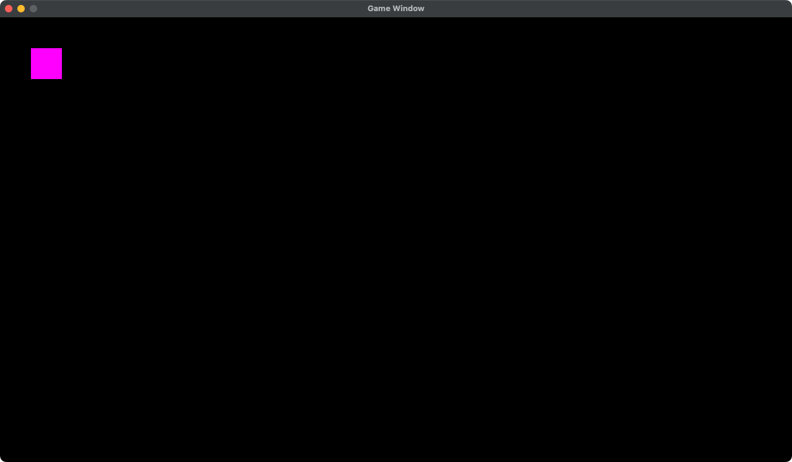
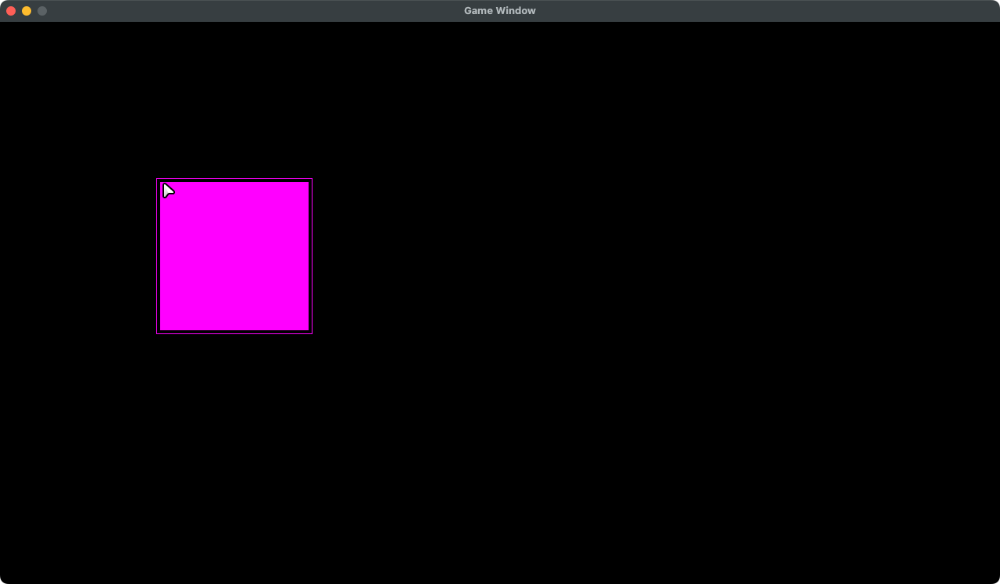
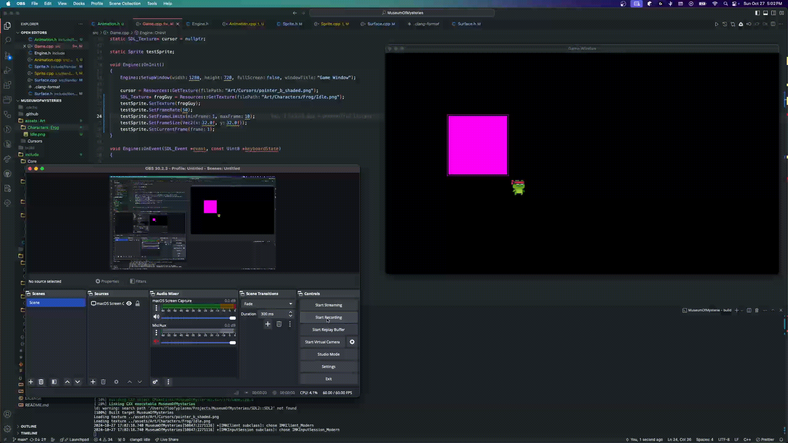
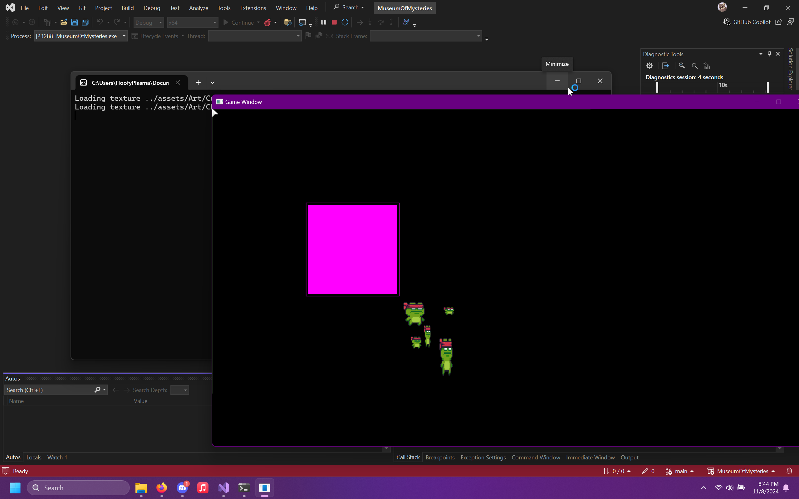
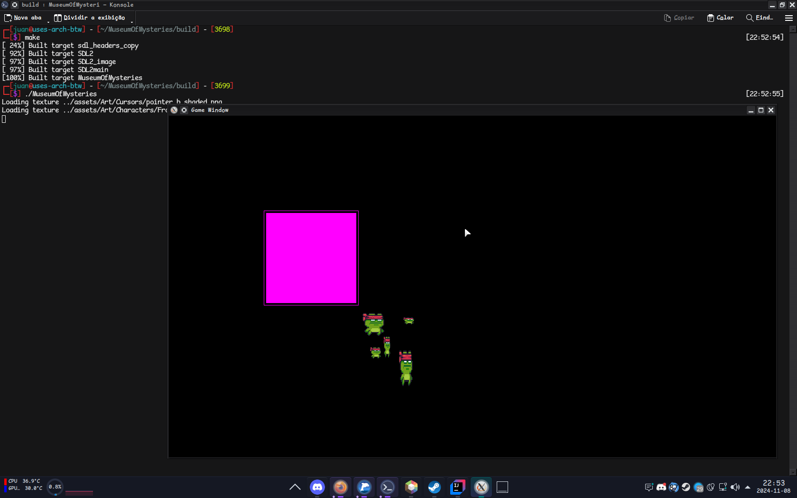

# Development Log

- 

  
October 23, 2024: Project Creation

    Nothing major to note today.
  

- 

    
October 24, 2024: Start a basic pipeline

    - Complete: Window class
    - Complete: Surface class
    - Complete: Sprite class

    I drew my first rectangle to my screen today. It is only one color, but it is progress!

    

    
Screenshots

    
    
    

    

- 

    
October 26, 2024: Start reading resources from the disk

    - Complete: File class
    - Complete: Resources class

    I drew my texture that I loaded from the disk. I also added the Kenny cursor asset pack.

    

    
Screenshots

    
    

    

- 

  
October 27, 2024: Various improvements + basic animation support

  
  - Complete: Vec2 class
  - Complete: Animation class

  I created a Vec2 class, it is being used in some places as a replacement for passing positions to objects.
  I also used that Vec2 class in animations, and added support for them in sprites.

  

  
Screenshots

  
  

  

- 

  
October 28, 2024: Basic mouse handling

  
  - Complete: Mouse class
  - Complete: Cursor class

  I replaced the default system cursor with a custom one I load from the Cursor asset pack.
  Right now, the cursor is pretty static, but its laying the framework for expansion in the future.
  I didn't have a lot of motivation to work today, and I just wanted to get at least something
  
  

  
Screenshots

  
  

  

- 

  
November 8, 2024: Cross platform building

  I got a Windows laptop a few days ago now, and I had to port my build system over to Windows.
  I still have to test and make sure that this works on macOS, but it builds the dependencies from source, and makes Visual Studio solution and run with one click.
  This build system seems to work on Linux too, if thats a platform that I decide that I want to end up supporting in the future.
  I had some issues with the CMakeLists.txt but I managed to work them out.
  
  

  
Screenshots

  

  And the build on Linux...

  
  

  

- 

  
November 9, 2024: Refactoring

    I did a lot of refactoring today. I changed some places to use Vec2 instead of ints for width and height.
    I also just broke up some large functions into smaller ones.
    No new behaviors today, just cleanups.
  
  
